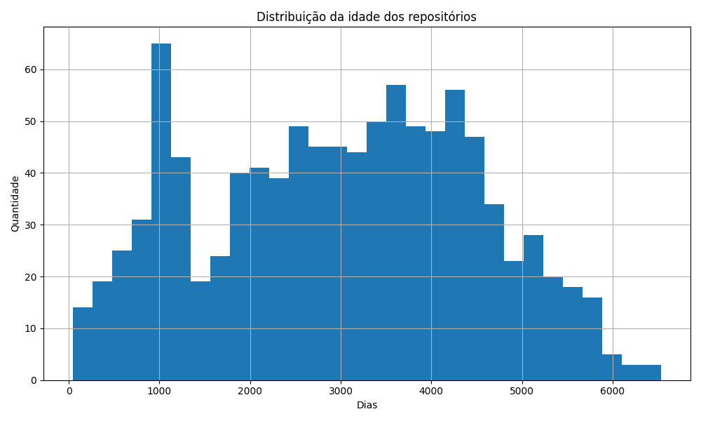
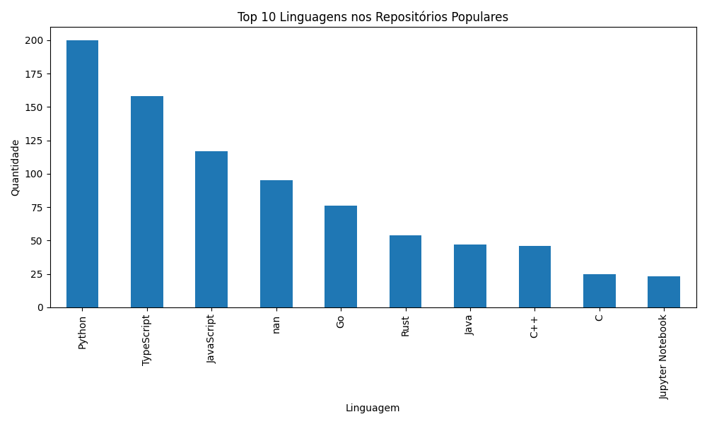

# Características de Repositórios Populares no GitHub

## Autores
Lucas Carvalho e Matheus Pretti.

---

# 1 Introdução

Este trabalho analisa características de desenvolvimento e manutenção dos 1.000 repositórios open-source com maior número de estrelas no GitHub, buscando entender padrões de maturidade, contribuição externa, releases, atualização, linguagens predominantes e fechamento de issues.

O GitHub é atualmente uma das principais plataformas de desenvolvimento colaborativo de software no mundo. Repositórios com grande número de estrelas geralmente representam projetos amplamente utilizados ou relevantes para a comunidade de desenvolvedores. Dessa forma, analisar características desses repositórios permite compreender melhor como projetos populares são desenvolvidos e mantidos.

---

# 2 Questões de Pesquisa e Hipóteses Informais

## RQ01. Sistemas populares são maduros/antigos?
- Métrica: idade do repositório (data atual - createdAt)  
- Hipótese: repositórios populares tendem a ser mais antigos e maduros.

## RQ02. Sistemas populares recebem muita contribuição externa?
- Métrica: total de pull requests aceitas (MERGED)  
- Hipótese: projetos populares recebem muitas pull requests aceitas devido ao grande número de colaboradores.

## RQ03. Sistemas populares lançam releases com frequência?
- Métrica: total de releases  
- Hipótese: projetos populares tendem a possuir múltiplos releases ao longo do tempo.

## RQ04. Sistemas populares são atualizados com frequência?
- Métrica: tempo até a última atualização (data atual - updatedAt)  
- Hipótese: projetos populares são frequentemente atualizados e mantidos ativamente.

## RQ05. Sistemas populares são escritos nas linguagens mais populares?
- Métrica: linguagem primária (primaryLanguage)  
- Hipótese: linguagens amplamente utilizadas como JavaScript, TypeScript e Python devem aparecer com maior frequência.

## RQ06. Sistemas populares possuem alto percentual de issues fechadas?
- Métrica: razão entre issues fechadas e total de issues  
- Hipótese: projetos populares possuem boa gestão de issues, com a maioria sendo resolvida.

---

# 3 Objetivo

O objetivo deste trabalho é coletar e analisar dados de repositórios populares no GitHub utilizando a API GraphQL da plataforma. A partir da coleta dos 1.000 repositórios com maior número de estrelas, pretende-se analisar características relacionadas à maturidade dos projetos, participação da comunidade, frequência de releases, atualização dos projetos, linguagens utilizadas e gerenciamento de issues.

---

# 4 Metodologia

A coleta de dados foi realizada utilizando a API GraphQL do GitHub. Foi desenvolvida uma query manual contendo as métricas necessárias para responder às questões de pesquisa propostas.

Para automatizar a coleta, foi implementado um script em Python responsável por realizar requisições HTTP POST autenticadas utilizando um token de acesso pessoal do GitHub.

Devido às limitações da API e possíveis instabilidades, foi implementado um mecanismo de paginação utilizando o cursor `endCursor`, permitindo acessar gradualmente os repositórios em múltiplas requisições. Cada requisição recupera um conjunto limitado de repositórios, sendo necessárias várias chamadas para alcançar os 1.000 repositórios analisados.

Para reduzir falhas temporárias da API (como erros HTTP 502 ou 504), o script implementa tentativas automáticas e pequenas pausas entre as requisições.

Os dados coletados foram armazenados em um arquivo CSV contendo as seguintes informações:

- nome do repositório
- URL do repositório
- número de estrelas
- data de criação
- data da última atualização
- idade do repositório em dias
- tempo desde a última atualização
- linguagem principal
- número de pull requests aceitas
- número de releases
- número de issues abertas
- número de issues fechadas
- razão entre issues fechadas e total de issues

Posteriormente, os dados foram analisados utilizando Python com as bibliotecas **Pandas** e **Matplotlib**, permitindo calcular estatísticas como medianas e gerar visualizações gráficas.

---

# 5 Resultados

A análise foi realizada sobre um conjunto de dados contendo 1.000 repositórios open-source populares no GitHub.

## RQ01 – Idade dos repositórios

A análise da idade dos repositórios indica que projetos populares geralmente possuem vários anos de existência. Isso sugere que a popularidade de um projeto está frequentemente associada à sua maturidade e estabilidade ao longo do tempo.

---

## RQ02 – Contribuição externa

Observou-se que muitos repositórios populares possuem um número significativo de pull requests aceitas. Esse resultado reforça a hipótese de que projetos populares possuem forte participação da comunidade de desenvolvedores.

---

## RQ03 – Releases

A análise do número de releases mostra que vários projetos populares possuem ciclos de lançamento contínuos. Isso indica manutenção ativa e evolução constante do software.

---

## RQ04 – Atualização dos projetos

Grande parte dos repositórios analisados apresenta atualizações recentes. Isso demonstra que projetos populares tendem a ser mantidos continuamente por seus desenvolvedores.

---

## RQ05 – Linguagens utilizadas

A análise das linguagens primárias revelou predominância de linguagens amplamente utilizadas no desenvolvimento moderno de software.

Entre as linguagens mais frequentes destacam-se linguagens populares como JavaScript, Python e TypeScript.

---

## RQ06 – Gerenciamento de issues

A análise da razão entre issues fechadas e o total de issues indica que muitos projetos populares apresentam alto índice de resolução de problemas. Isso demonstra uma gestão ativa das issues e participação da comunidade na manutenção do projeto.

---

# 6 Discussão

Os resultados obtidos indicam que repositórios populares no GitHub compartilham algumas características comuns. Em geral, esses projetos tendem a ser relativamente antigos, bem estabelecidos e mantidos ao longo do tempo.

Além disso, observa-se uma forte participação da comunidade de desenvolvedores por meio de pull requests e contribuições externas. A predominância de linguagens amplamente utilizadas na indústria também reflete tendências atuais no desenvolvimento de software.

Outro ponto relevante é a alta taxa de fechamento de issues, o que sugere uma gestão eficiente dos problemas reportados pelos usuários e colaboradores.

De modo geral, os resultados observados confirmam as hipóteses iniciais apresentadas nas questões de pesquisa.

---

# 7 Conclusão

Este trabalho apresentou uma análise de características de desenvolvimento de repositórios populares no GitHub utilizando dados coletados através da API GraphQL da plataforma.

Foi possível coletar e analisar informações de 1.000 repositórios populares, permitindo identificar padrões relacionados à maturidade dos projetos, participação da comunidade, frequência de releases, atualização dos sistemas, linguagens predominantes e gerenciamento de issues.

Os resultados indicam que projetos populares tendem a ser maduros, frequentemente atualizados e altamente colaborativos, contando com forte participação da comunidade open-source.

Essas características reforçam a importância da colaboração, manutenção contínua e adoção de tecnologias amplamente utilizadas para o sucesso de projetos open-source.